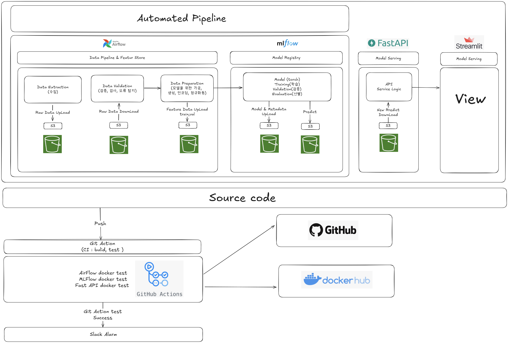

<br>

## 💻 프로젝트 소개
### <프로젝트 소개>
- 서울 1시간 간격의 기온의 데이터러 7일 날씨 예측 + 옷추천

<br>

## 👨‍👩‍👦‍👦 팀 구성원

|  |  |  |  |  |
| :--------------------------------------------------------------: | :--------------------------------------------------------------: | :--------------------------------------------------------------: | :--------------------------------------------------------------: | :--------------------------------------------------------------: |
|            [이승민](https://github.com/UpstageAILab)             |            [문국현](https://github.com/UpstageAILab)             |            [홍정민](https://github.com/UpstageAILab)             |            [문진숙](https://github.com/UpstageAILab)             |            [조선미](https://github.com/UpstageAILab)             |
|                            팀장, Data Pipline                             |                            model reegistry                             |                            model serving                             |                            mlops docker test                             |                            mlops docker test                             |

<br>

## 🔨 개발 환경 및 기술 스택
- 주 언어 : python
- 버전 및 이슈관리 : github, git action
- 협업 툴 : notion

<br>

## 📁 프로젝트 구조
```
│  .dockerignore
│  .gitignore
│  Makefile
│  mlflow.db
│  README.md
│
├─.github
│  └─workflows
│          build-and-test-api.yml
│
├─docs
│  │  [패스트캠퍼스]-Upstage-AI-Lab-7기_MLops_3조.pdf
│  │
│  └─assets
├─mlflow_server
│      mlflow.db
│
└─mlops_team
    │  .env
    │  .env.template
    │  airflow.start.sh
    │  docker-compose.yml
    │  Dockerfile.airflow
    │  Dockerfile.mlflow
    │  mlflow.start.sh
    │  requirements.txt
    │
    ├─airflow
    │  └─dags
    │      ├─weather
    │      │      v1_0_0_weather_pipeline.py
    │      │
    │      └─__pycache__
    │              weather_pipeline.cpython-38.pyc
    │
    ├─app
    │      app.start.sh
    │      Dockerfile.app
    │      requirements.txt
    │
    ├─common
    │      recommender.py
    │      s3_loader.py
    │
    ├─data
    │  │  2020-2025.csv
    │  │  __init__.py
    │  │
    │  ├─utils
    │  │  │  constants.py
    │  │  │  utils.py
    │  │  │  __init__.py
    │  │  │
    │  │  └─__pycache__
    │  │          constants.cpython-310.pyc
    │  │          constants.cpython-38.pyc
    │  │          db_utils.cpython-310.pyc
    │  │          db_utils.cpython-38.pyc
    │  │          utils.cpython-310.pyc
    │  │          utils.cpython-38.pyc
    │  │          __init__.cpython-310.pyc
    │  │
    │  ├─wearher
    │  │  └─v1_0_0
    │  │          ingest_raw_wearher.py
    │  │          preprocess.py
    │  │
    │  └─__pycache__
    │          preprocess.cpython-310.pyc
    │          __init__.cpython-310.pyc
    │
    ├─docs
    │      mini_data_collector_overview.md
    │      weather_1hour_feature_list.md
    │      weather_feature_list.md
    │
    ├─ML
    │      ML-pipeline.py
    │      ML-Preprocessing.py
    │      ML-split_data.py
    │      ML-train.py
    │
    ├─mlflow
    │      mlflow.db
    │
    ├─notebook
    │      03_check_s3_csv.ipynb
    │      DL-Test.ipynb
    │      ML-Test.ipynb
    │
    ├─scripts
    │  │  inference.py
    │  │  pipeline.py
    │  │  preprocess.py
    │  │  train.py
    │  │
    │  └─__pycache__
    │          inference.cpython-310.pyc
    │          preprocess.cpython-310.pyc
    │          Preprocessing.cpython-310.pyc
    │          train.cpython-310.pyc
    │          train_model.cpython-310.pyc
    │
    ├─src
    │      main.py
    │
    ├─streamlit_app
    │      dashboard.py
    │
    └─test
        │  .env.example
        │  ci-api.yml.disabled
        │  clothing_rules.py
        │  debug-build.yml
        │  test_s3_upload_download.py
        │
        └─dags
                my_first_dag.py

```

<br>

## 💻​ 구현 기능
### 기능1
- raw 원시 데이터를 업데이트 관리
### 기능2
- raw 데이터를 전처리 및 인코딩 관리
### 기능3
- model train 및 Registry
### 기능4
- model serving
### 기능 5
- 시각화
### 기능 6
- CI/CD

<br>

## 🛠️ 작품 아키텍처


<br>

## 🚨​ 트러블 슈팅
### 1. docker Copy no find sh 에러 발견

#### 설명
- docker 빌드중 airflow.start.sh 파일을 읽을 수 없음

#### 해결
- window, linux 환경은 줄바꿈을 /r/n  /n 으로 구분 되어 포멧방식을
CRLF -> LF 변경하여 해결

<br>

## 📌 프로젝트 회고
### 이승민
- 전체 워크플로우를 단계별로 나누고, 각 Task 를 독립적인 모듈로 분리해 맡은 역할에 집중할 수 있었고 모듈화 덕분에 작업 분담이 
               명확해졌고, 각자 맡은 영역의 관리와 고도화가 용이해 좋았고 이러한 구조는 협업을 어떻게 하는지 경험 할 수 있어 좋았습니다.

### 문국현
- MLOps 인프라를 구현하며 실시간 데이터 누락, 시계열 정렬, 모델 예측 문제, 등 다양한 문제를 직접 해결해보며 자동화의 복잡성과 중요성을 경험할 수 있어서 좋았습니다.

### 홍정민
- MLops를 전반적으로 경험할 수 있어서 의미 있는 시간이었습니다. MLOps 너무 재미있어서 오랜만에 몰입을 경험했습니다.

### 조건민
- 혼자서는 이해하기 어려웠을 MLOps 개념(AWS S3, MLflow, Airflow, Docker)을 팀원들의 도움으로 잘 익힐 수 있었습니다. 팀 프로젝트에 함께할 수 있어 감사했습니다.

### 문진숙
- MLOps를 처음 접하다보니 개념 설정부터 구현까지 각 과정마다 무수히 많은 시행착오를 겪었는데 노션과 슬랙, 블로그에 상세한 튜토리얼을 공유해주셔서 전체적인 프로세스를 이해하는 데 매우 큰 도움을 받았습니다. 팀원분들께 정말 감사합니다.


<br>

## 📰​ 참고자료
- _참고자료를 첨부해주세요_
